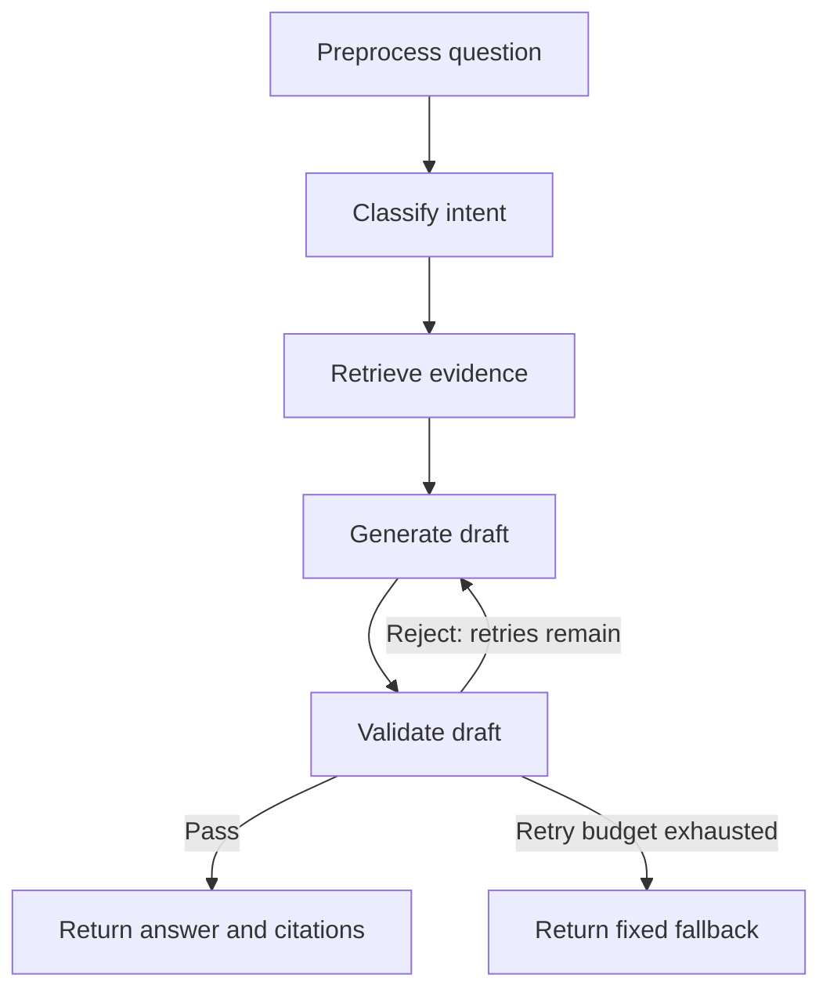

# ETF Answer Agent

**A Korean-language ETF question-answering prototype with retrieval, a LangGraph validation loop, and interchangeable model backends.**

[한국어](README.ko.md) · [Streamlit demo](https://etf-answer-agent.streamlit.app) · [Browser-only demo](https://sunghyunc.github.io/etf-answer-agent/) · [Evaluation report](TEST_REPORT.md)

Built as a learning project around a hypothetical asset-manager chatbot brief. The core engineering question is how to route questions to evidence, inspect generated answers, and retry rejected drafts before returning a response. The repository includes a no-key rule backend, local/OpenAI model adapters, two web interfaces, and evaluation tooling.

**All ETF records and documents are demo samples, not current product information or investment advice.** The checks are experimental and do not establish regulatory compliance.

## What it demonstrates

- **Explicit workflow control:** five LangGraph nodes with a conditional validation → generation edge, up to two regenerations, and a fixed fallback when rejected drafts exhaust that budget.
- **Retrieval by intent:** separate product, FAQ, and disclosure collections using character n-gram TF-IDF, alongside structured ETF records.
- **Inspectable answers:** citations, intent labels, processing traces, and rejection details in the UI.
- **Backend separation:** rule-only execution, a local OpenAI-compatible endpoint such as Ollama/vLLM, or OpenAI API calls.
- **Evaluation and operations:** development/test datasets, prompt experiments, JSONL request events, feedback, latency summaries, and Prometheus-format metrics.

## Architecture



The validation node checks prohibited expressions and unsupported numerical claims. With an LLM backend enabled, the pipeline also performs question-level safety checks and an answer-faithfulness check. Traversing the gate does **not** guarantee factual accuracy: the checks can miss violations, and the optional faithfulness check currently skips its judgment when its model call fails.

## Run locally

Use Python 3.11, the version configured in CI and Docker. The following commands use a macOS/Linux shell:

```bash
git clone https://github.com/SungHyunC/etf-answer-agent.git
cd etf-answer-agent
python3.11 -m venv .venv
source .venv/bin/activate
python -m pip install -r requirements.txt
LLM_BACKEND=rule streamlit run streamlit_app.py
```

Open [localhost:8501](http://localhost:8501). A fresh setup uses the rule backend without an API key. If Streamlit Secrets contains `OPENAI_API_KEY`, the Streamlit entrypoint selects the OpenAI backend instead.

Example questions: `ETF가 뭔가요?`, `KODEX 200 구성종목 알려줘`, or `ETF 추천해주세요` to inspect a refusal path.

Other entrypoints, run separately from the repository root:

| Command | Purpose |
|---|---|
| `LLM_BACKEND=rule python cli.py` | Scripted examples followed by interactive questions |
| `HOST=127.0.0.1 LLM_BACKEND=rule python app.py` | Local web UI and JSON API at port 8000 |
| `python -m http.server 8080 --directory docs --bind 127.0.0.1` | Static JavaScript rule demo at port 8080; no Python pipeline dependencies needed |

For the JSON API, submit questions to `POST /ask` as `{"q":"ETF가 뭔가요?"}`. The service also exposes `GET /health`, `GET /metrics`, `GET /metrics/prometheus`, and `POST /feedback`.

## Model configuration

| `LLM_BACKEND` | Configuration | Behavior |
|---|---|---|
| `rule` (default) | No model credentials | TF-IDF retrieval and template-based responses |
| `local` | `LOCAL_BASE_URL`, `LOCAL_MODEL`, `LOCAL_API_KEY` | OpenAI-compatible model server you run separately |
| `openai` | `OPENAI_API_KEY`, optional `OPENAI_MODEL` | Remote model calls; questions and evidence are sent to the API |

For example, after starting a compatible local model server:

```bash
LLM_BACKEND=local \
LOCAL_BASE_URL=http://localhost:11434/v1 \
LOCAL_MODEL=qwen2.5:14b-instruct \
python cli.py
```

[`.env.example`](.env.example) lists configuration examples. Native Python entrypoints read the process environment; copying that file to `.env` alone does not load it. Docker Compose reads `.env`. See [deployment notes](DEPLOY.md) for container and hosting options.

## Tests and evaluation

```bash
# Deterministic pipeline checks, including a forced rejection/retry path
LLM_BACKEND=rule python tests/test_pipeline.py

# Original development examples; not an independent benchmark
LLM_BACKEND=rule python -m src.evaluate

# Development split for iteration
LLM_BACKEND=rule HOLDOUT_SPLIT=dev python -m src.eval.holdout

# Separate test split for evaluation
LLM_BACKEND=rule HOLDOUT_SPLIT=test python -m src.eval.holdout
```

[CI](.github/workflows/ci.yml) runs the pipeline checks, the original evaluation harness, and a Docker image build. The evaluation harness reports scores; a successful CI run is not a quality threshold guarantee.

The [2026-08-29 report](TEST_REPORT.md) records the following historical test-split results for 17 intent/fact questions and 5 blocking questions:

| Metric | Rule backend | Local Qwen 2.5 14B |
|---|---:|---:|
| Intent accuracy | 47.1% | 52.9% |
| Required-fact coverage | 75.0% | 57.5% |
| Blocking on 5 designated questions | 0/5 | 5/5 |

These are small, author-created samples, not production benchmarks. Fact coverage uses string matching in rule mode and can use an LLM judge in model mode, so the scores are not directly equivalent. The report also documents test-set leakage in earlier results and a subsequent change that still needs a fresh held-out set. Treat these numbers as an experiment record, not verified results for the current revision.

## Code map

| Path | Responsibility |
|---|---|
| [`src/graph.py`](src/graph.py), [`src/state.py`](src/state.py) | Graph topology and state |
| [`src/nodes/`](src/nodes/) | Preprocessing, classification, retrieval, generation, validation |
| [`src/data/`](src/data/) | Sample ETF records, knowledge collections, TF-IDF retrieval |
| [`src/llm.py`](src/llm.py), [`src/config.py`](src/config.py) | Model adapter and environment configuration |
| [`src/eval/`](src/eval/), [`tests/`](tests/) | Held-out evaluation, prompt experiments, fixtures, pipeline checks |
| [`src/monitoring.py`](src/monitoring.py) | Request events, feedback, metrics |
| [`streamlit_app.py`](streamlit_app.py), [`app.py`](app.py), [`cli.py`](cli.py) | User and API entrypoints |
| [`docs/`](docs/) | Separate browser-only JavaScript implementation and sample-data snapshot |

## Current limitations

- The corpus contains five sample ETF records and 17 documents, with no live market or disclosure feed.
- Conversation history is displayed in the UI, but each graph invocation answers one question without prior-turn context.
- The rule backend has poor generalization on the recorded blocking test. Model checks can also miss errors or overblock legitimate questions.
- There is no authentication layer or validated financial-service deployment. The HTTP server is a development prototype; concurrent-load behavior has not been established in the report.
- Request monitoring stores question excerpts in `logs/events.jsonl`; use sample questions when demonstrating the app.

Further reading: [Korean project notes](README.ko.md), [test report](TEST_REPORT.md), [raw recorded results](RESULTS.txt), [deployment guide](DEPLOY.md), [static demo guide](docs/README.md).

## License

[MIT](LICENSE).
